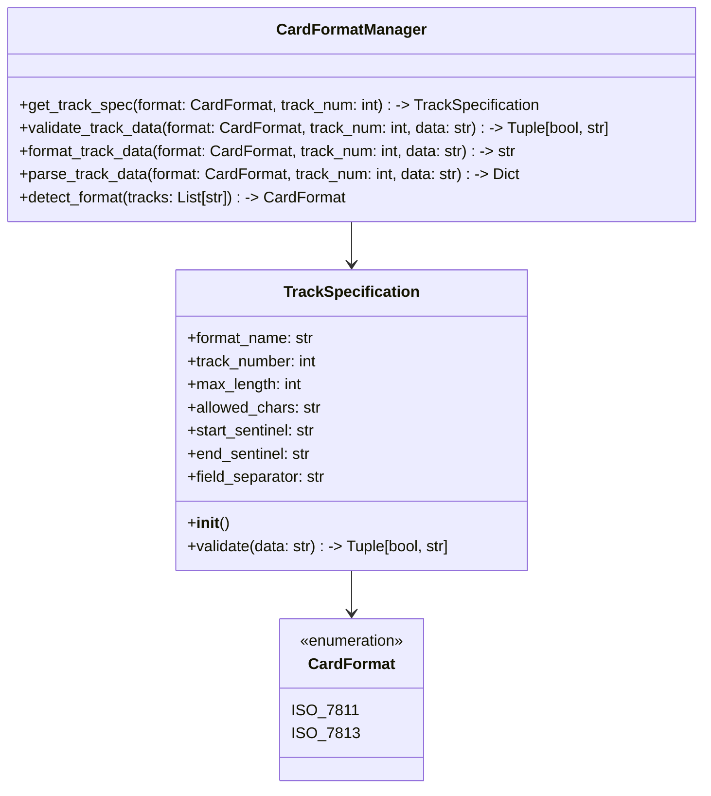

# MSR605 Card Reader/Writer - User Guide

Welcome to the MSR605 Card Reader/Writer user guide! This document will help you get started with using the application to read from and write to magnetic stripe cards.

## Table of Contents
1. [Installation](#installation)
2. [Getting Started](#getting-started)
3. [Reading Cards](#reading-cards)
4. [Writing Cards](#writing-cards)
5. [Configuration](#configuration)
6. [Troubleshooting](#troubleshooting)

## Installation

### Windows
1. Download the latest installer from the [Releases](https://github.com/Nsfr750/MSR605/releases) page
2. Run the installer and follow the on-screen instructions
3. Connect your MSR605 device to an available USB port
4. Launch the application from the Start Menu or desktop shortcut

### Linux/macOS
1. Ensure you have Python 3.8+ installed
2. Install the required dependencies:
   ```bash
   pip install -r requirements.txt
   ```
3. Run the application:
   ```bash
   python main.py
   ```

## Getting Started

### Connecting the Device
1. Connect your MSR605 device to your computer using the USB cable
2. The application should automatically detect the device
3. The status bar will show "Device Connected" when successful

### Main Interface
- **Card Data Display**: Shows the data read from the card
- **Track Selection**: Choose which tracks to read/write (1, 2, and/or 3)
- **Action Buttons**: Read, Write, and Clear functions
- **Status Bar**: Displays connection status and operation results

## Reading Cards

1. Insert a magnetic stripe card into the reader
2. Click the "Read" button
3. The card data will be displayed in the main window
4. To save the data, click "File" > "Save As..."

## Writing Cards

1. Insert a writable magnetic stripe card into the writer
2. Enter or paste the data you want to write in the appropriate track fields
3. Select which tracks you want to write to
4. Click the "Write" button
5. The status bar will show the result of the operation

## Card Format Support

The application supports two major magnetic card standards: ISO 7811 and ISO 7813. Understanding these formats is crucial for proper card reading and writing operations.

### ISO 7811

ISO 7811 is the international standard for identification cards with magnetic stripes. It defines:

- **Track 1**: Alphanumeric data (up to 79 characters)
  - Format: `%[format code][primary account number]^[name]^[expiration date][service code][discretionary data]?`
  - Example: `%B1234567890123456^CARDHOLDER/NAME^24011234567890123456789?`

- **Track 2**: Numeric data (up to 40 characters)
  - Format: `;[primary account number]=[expiration date][service code][discretionary data]?`
  - Example: `;1234567890123456=24011234567890123456?`

- **Track 3**: Read/write capability (not commonly used)
  - Primarily numeric data
  - Used for financial transactions and value updates

### ISO 7813

ISO 7813 is a subset of ISO 7811 specifically for financial transaction cards. Key differences:

- **Track 1**: More strictly formatted
  - Format code must be 'B' (banking)
  - Fixed field lengths for certain data elements
  - Example: `%B1234567890123456^CARDHOLDER/NAME^24011234567890123456789?`

- **Track 2**: Similar to ISO 7811 but with specific validation rules
  - Example: `;1234567890123456=24011234567890123456?`

### Selecting the Correct Format

1. Go to **Settings** > **Card Format**
2. Choose between:
   - **Auto-detect** (default): Automatically detects the card format
   - **ISO 7811**: For general purpose cards
   - **ISO 7813**: For financial transaction cards
3. Click **Apply** to save the settings

## Writing Cards

1. Select the tracks you want to write to
2. Choose the appropriate card format (ISO 7811 or ISO 7813)
3. Enter the data in the appropriate track fields following the selected format
4. Click the "Write" button
5. The application will validate the data and perform the write operation
6. The operation status will be displayed in the status bar

## Configuration

### Device Settings
- **Baud Rate**: Adjust the communication speed (default: 9600)
- **Parity**: Set the parity (None, Even, Odd, Mark, Space)
- **Data Bits**: Set the number of data bits (default: 8)
- **Stop Bits**: Set the number of stop bits (default: 1)

### Application Settings
- **Auto-detect Device**: Enable/disable automatic device detection
- **Start Minimized**: Launch the application minimized to system tray
- **Save Logs**: Enable logging of operations to a file

## Troubleshooting

### Common Issues

#### Device Not Detected
- Ensure the device is properly connected to the USB port
- Try a different USB port
- Check if the device is recognized in your system's Device Manager
- Restart the application

#### Reading/Writing Fails
- Ensure the card is properly inserted
- Clean the card's magnetic stripe
- Verify the card is not write-protected
- Check the track configuration matches the card format

#### Application Crashes
- Ensure you have the latest version installed
- Check the log file for error details
- Try reinstalling the application


# MSR605 Card Reader/Writer - API Documentation

This document provides detailed information about the MSR605 Card Reader/Writer API for developers who want to extend or integrate with the application.

## Table of Contents
1. [Overview](#overview)
2. [Core Modules](#core-modules)
3. [Device Communication](#device-communication)
4. [Card Operations](#card-operations)
5. [Data Formats](#data-formats)
6. [Error Handling](#error-handling)
7. [Examples](#examples)

## Overview

The MSR605 API provides a Python interface for interacting with magnetic stripe card readers/writers. The API is designed to be easy to use while providing access to all device features.

## Core Modules

### `msr605`
The main module containing the core functionality.

#### `MSR605` Class
```python
class MSR605:
    def __init__(self, port=None, baudrate=9600, timeout=1):
        """Initialize the MSR605 device connection.
        
        Args:
            port (str, optional): Serial port name. If None, auto-detection is attempted.
            baudrate (int, optional): Communication baud rate. Defaults to 9600.
            timeout (int, optional): Read timeout in seconds. Defaults to 1.
        """
        pass
    
    def connect(self):
        """Establish connection to the device."""
        pass
    
    def disconnect(self):
        """Close the connection to the device."""
        pass
    
    def is_connected(self):
        """Check if the device is connected.
        
        Returns:
            bool: True if connected, False otherwise.
        """
        pass
    
    def read_card(self, tracks=[1, 2, 3]):
        """Read data from a magnetic stripe card.
        
        Args:
            tracks (list, optional): List of tracks to read (1, 2, 3). Defaults to all tracks.
            
        Returns:
            dict: Dictionary containing track data with track numbers as keys.
        """
        pass
    
    def write_card(self, track_data, verify=True):
        """Write data to a magnetic stripe card.
        
        Args:
            track_data (dict): Dictionary with track numbers as keys and data as values.
            verify (bool, optional): Whether to verify the written data. Defaults to True.
            
        Returns:
            bool: True if write was successful, False otherwise.
        """
        pass
```

## Device Communication

### Serial Protocol

#### Commands
| Command | Description | Format |
|---------|-------------|--------|
| `ESC e` | Reset device | `\x1be` |
| `ESC s` | Read card | `\x1bs` |
| `ESC w` | Write card | `\x1bw` |
| `ESC x` | Set security level | `\x1bx` |

#### Responses
| Response | Description |
|----------|-------------|
| `\x1b1` | Command successful |
| `\x1b2` | Command failed |
| `\x1b3` | No card present |
| `\x1b4` | Write protect error |

## Card Operations

### Reading Data
```python
from msr605 import MSR605

# Initialize and connect to the device
device = MSR605()
device.connect()

# Read all tracks
data = device.read_card()
print(f"Track 1: {data.get(1, 'No data')}")
print(f"Track 2: {data.get(2, 'No data')}")
print(f"Track 3: {data.get(3, 'No data')}")

# Read specific tracks
data = device.read_card(tracks=[1, 2])

# Disconnect
device.disconnect()
```

### Writing Data
```python
from msr605 import MSR605

# Initialize and connect to the device
device = MSR605()
device.connect()

# Prepare track data
track_data = {
    1: "%B1234567890123456^CARDHOLDER/NAME^25121010000000000000000000000000000?",
    2: ";1234567890123456=25121010000000000000?",
    3: ""  # Empty track 3
}

# Write to card
success = device.write_card(track_data)
print(f"Write {'successful' if success else 'failed'}")

# Disconnect
device.disconnect()
```

## Data Formats

### Track Formats
- **Track 1 (IATA)**: Up to 79 alphanumeric characters
- **Track 2 (ABA)**: Up to 40 numeric characters
- **Track 3 (THRIFT)**: Up to 107 numeric characters

### Special Characters
| Character | Description |
|-----------|-------------|
| `%` | Start sentinel (Track 1) |
| `;` | Start sentinel (Track 2 & 3) |
| `?` | End sentinel |
| `^` | Separator (Track 1) |
| `=` | Separator (Track 2) |
| `\\` | Escape character |

## Error Handling

### Exceptions
| Exception | Description |
|-----------|-------------|
| `MSR605Error` | Base exception for all MSR605 errors |
| `MSR605ConnectionError` | Connection-related errors |
| `MSR605CommandError` | Command execution errors |
| `MSR605CardError` | Card operation errors |

### Example
```python
from msr605 import MSR605, MSR605Error

try:
    device = MSR605()
    device.connect()
    data = device.read_card()
    print(data)
except MSR605Error as e:
    print(f"Error: {e}")
finally:
    if 'device' in locals():
        device.disconnect()
```

## Examples

### Basic Usage
```python
from msr605 import MSR605

def main():
    try:
        # Initialize and connect
        device = MSR605()
        print("Connecting to device...")
        device.connect()
        
        if not device.is_connected():
            print("Failed to connect to device")
            return
            
        print("Connected. Please swipe a card...")
        
        # Read card
        data = device.read_card()
        print("\nCard Data:")
        for track, value in data.items():
            print(f"Track {track}: {value}")
            
    except Exception as e:
        print(f"An error occurred: {e}")
    finally:
        if 'device' in locals():
            device.disconnect()
            print("\nDisconnected from device")

if __name__ == "__main__":
    main()
```

### Advanced Usage
```python
from msr605 import MSR605
import json
import time

class CardManager:
    def __init__(self):
        self.device = MSR605()
        self.config = self._load_config()
        
    def _load_config(self):
        # Load configuration from file
        try:
            with open('config.json', 'r') as f:
                return json.load(f)
        except FileNotFoundError:
            return {'baudrate': 9600, 'timeout': 1}
            
    def start(self):
        try:
            # Connect with config
            self.device = MSR605(
                baudrate=self.config.get('baudrate', 9600),
                timeout=self.config.get('timeout', 1)
            )
            self.device.connect()
            
            print("Card reader ready. Press Ctrl+C to exit.")
            
            while True:
                print("\nSwipe a card or press Ctrl+C to exit...")
                try:
                    data = self.device.read_card()
                    self._process_card(data)
                except Exception as e:
                    print(f"Error reading card: {e}")
                
                time.sleep(0.5)
                
        except KeyboardInterrupt:
            print("\nExiting...")
        finally:
            if hasattr(self, 'device') and self.device.is_connected():
                self.device.disconnect()
    
    def _process_card(self, data):
        print("\nCard Data:")
        for track, value in data.items():
            print(f"Track {track}: {value}")
        
        # Save to file
        with open('card_data.log', 'a') as f:
            f.write(f"{time.ctime()}: {data}\n")

if __name__ == "__main__":
    manager = CardManager()
    manager.start()
```


# Frequently Asked Questions (FAQ)

## General Questions

### What is the MSR605 Card Reader/Writer?
The MSR605 is a software application that allows you to read from and write to magnetic stripe cards using compatible card reader/writer devices. It provides a user-friendly interface for managing card data.

### What operating systems are supported?
The application is designed to work on:
- Windows 10/11 (64-bit)
- Linux (most distributions)
- macOS (Intel and Apple Silicon)

### Where can I download the latest version?
You can download the latest release from our [GitHub Releases](https://github.com/yourusername/MSR605/releases) page.

## Installation

### What are the system requirements?
- Python 3.8 or higher
- USB port for the card reader
- 100MB free disk space
- 2GB RAM minimum (4GB recommended)

### How do I install the required drivers?
- **Windows**: Drivers should install automatically when you connect the device
- **Linux**: Most distributions include the necessary drivers
- **macOS**: No additional drivers are typically needed

### Why isn't my device being detected?
1. Ensure the device is properly connected to a USB port
2. Try a different USB port
3. Check if the device appears in your system's device manager
4. Restart the application
5. Make sure no other application is using the device

## Usage

### How do I read a card?
1. Insert the card into the reader
2. Click the "Read" button
3. The card data will be displayed in the main window

### How do I write to a card?
1. Insert a writable card
2. Enter the data you want to write
3. Select which tracks to write to
4. Click the "Write" button

### What card formats are supported?
The application supports standard magnetic stripe formats:
- Track 1 (IATA): Up to 79 alphanumeric characters
- Track 2 (ABA): Up to 40 numeric characters
- Track 3 (THRIFT): Up to 107 numeric characters

### Why is my card not being read?
- The card may be damaged or demagnetized
- The card might be inserted incorrectly
- The magnetic stripe might be dirty (clean it with a soft cloth)
- The card format might not be supported

## Troubleshooting

### The application crashes on startup
1. Make sure you have all required dependencies installed
2. Check the log file for error messages
3. Try reinstalling the application
4. Contact support with the error details

### I'm getting "Device not found" errors
1. Disconnect and reconnect the device
2. Try a different USB port
3. Restart your computer
4. Check if the device is recognized by your operating system

### The data written to the card isn't being read correctly
1. Verify the data format matches the track specifications
2. Try writing to a different track
3. Test with a different card
4. Check if the write head needs cleaning

## Security

### Is my card data secure?
The application processes all data locally on your computer. No card data is transmitted over the internet unless you explicitly choose to export or share it.

### Can I encrypt the card data?
Yes, the application supports encrypting card data before writing to the card. Enable this option in the settings.

### What security features are available?
- Data encryption
- Password protection for saved files
- Secure data wiping
- Audit logging

## Development

### How can I contribute to the project?
We welcome contributions! Please see our [Contributing Guidelines](CONTRIBUTING.md) for more information.

### Is there an API available?
Yes, the application provides a Python API for integration with other applications. See the [API Documentation](API.md) for details.

### How do I report a bug?
Please open an issue on our [GitHub Issues](https://github.com/yourusername/MSR605/issues) page with the following information:
- Steps to reproduce the issue
- Expected behavior
- Actual behavior
- Screenshots (if applicable)
- System information

## Support

### Where can I get help?
- Check the [User Guide](user_guide.md) for detailed instructions
- Search or post on our [GitHub Discussions](https://github.com/yourusername/MSR605/discussions)
- Email support@example.com for direct assistance

### Is there a community forum?
Yes, you can join our community forum at [forum.example.com](https://forum.example.com) to ask questions and share experiences with other users.

## Legal

### What are the licensing terms?
This software is licensed under the GPLv3 License. See the [LICENSE](LICENSE) file for details.

### Can I use this for commercial purposes?
Yes, the GPLv3 license allows for commercial use, but be aware of the license requirements regarding distribution of source code for any modifications you make.

### Where can I find the source code?
The complete source code is available on [GitHub](https://github.com/yourusername/MSR605).

# Technical Reference for MSR605 Card Reader/Writer

## Architecture Overview

### System Components
- **GUI Module**: `GUI.py`
- **Card Reader Interface**: `cardReader.py`
- **Database Management**: Integrated SQLite
- **Version Control**: `version.py`
- **Sponsor Management**: `sponsor.py`
- **About Information**: `about.py`

## Software Design

### Design Principles
- Modular architecture
- Separation of concerns
- High cohesion
- Low coupling

### Module Responsibilities

#### GUI Module
- User interaction handling
- Window management
- Event processing

#### Card Reader Module
- Hardware communication
- Low-level card reading/writing
- Error handling
- Track data processing

#### Database Module
- Data persistence
- CRUD operations
- Query management

## Communication Protocols

### Serial Communication
- Baud Rate: 9600
- Data Bits: 8
- Stop Bits: 1
- Parity: None
- Flow Control: None

## Card Format Implementation

The application implements a flexible card format system supporting multiple magnetic stripe card standards. This section details the technical implementation of the format handling system.

### Card Format Architecture

#### Core Components

- **CardFormat Enum**: Defines supported formats (ISO_7811, ISO_7813)
- **TrackSpecification Class**: Defines track characteristics for each format
- **CardFormatManager**: Manages format validation and data parsing
- **Format Detection**: Auto-detects card format based on track data

#### Class Hierarchy



### Card Data Encoding

#### Supported Standards

- **ISO/IEC 7811**: General purpose magnetic stripe cards
- **ISO/IEC 7813**: Financial transaction cards (subset of 7811)

#### Track Specifications

##### ISO 7811

- **Track 1**: Alphanumeric (up to 79 chars)
  - Format: `%[format code][primary account number]^[name]^[expiration date][service code][discretionary data]?`
  - Character Set: A-Z, 0-9, space, !"%&'()*+,-./:;<=>?_#
  

- **Track 2**: Numeric (up to 40 chars)
  - Format: `;[primary account number]=[expiration date][service code][discretionary data]?`
  - Character Set: 0-9, =, ?
  

- **Track 3**: Read/Write (up to 107 chars)
  - Primarily numeric data
  - Used for financial transactions

##### ISO 7813 (Financial Transaction Cards)

- **Track 1**: Strictly formatted
  - Format code must be 'B' (banking)
  - Fixed field lengths for certain elements
  - Enhanced validation rules
  

- **Track 2**: Numeric with specific validation
  - Similar to ISO 7811 but with additional constraints
  - Strict field validation

### Data Flow

1. **Reading a Card**

   - Read raw track data from hardware
   - Auto-detect format based on track data
   - Parse and validate data according to format
   - Return structured data object

2. **Writing a Card**

   - Validate input data against selected format
   - Format data according to track specifications
   - Write formatted data to card
   - Verify write operation

### Error Handling

#### Validation Errors

- **Invalid Format**: Data doesn't match expected format
- **Invalid Character**: Unsupported character in track data
- **Field Length**: Data exceeds maximum track length
- **Missing Sentinel**: Missing start/end sentinels
- **Invalid Field**: Field validation failed (e.g., invalid expiration date)

#### Recovery

- Detailed error messages with specific validation failures
- Automatic format detection fallback
- Graceful degradation when partial data is available
- Track 2: ABA format
- Track 3: Custom/Extended format

## Performance Metrics

### Read/Write Speed
- Average Read Time: <500ms
- Average Write Time: <1000ms
- Maximum Tracks: 3

### Resource Utilization
- Memory Footprint: <100MB
- CPU Usage: Low to Moderate
- Disk Space: <500MB

## Error Handling

### Error Categories
- Hardware Errors
- Communication Errors
- Data Parsing Errors
- Database Errors

### Error Logging
- Timestamp
- Error Type
- Detailed Description
- Suggested Resolution

## Security Considerations

### Data Protection
- No card data storage without consent
- Encrypted database (optional)
- Configurable data retention policies

### Compliance
- GDPR considerations
- PCI DSS guidelines
- Data minimization principles

## Extensibility

### Plugin Architecture
- Support for custom track parsers
- Extensible database backends
- Configurable hardware interfaces

## Development Environment

### Recommended Tools
- Python 3.12+
- Visual Studio Code
- PyCharm
- Git
- Virtual Environment

### Recommended Extensions
- Python
- Pylance
- GitLens
- Markdown All in One

## Build and Deployment

### Build Process
- Use `pyinstaller` for executable
- Create platform-specific installers
- Sign executables

### Continuous Integration
- GitHub Actions
- Automated testing
- Version compatibility checks

## API and Extensibility

### Public Methods
- `read_card()`
- `write_card()`
- `decode_track()`
- `export_database()`

### Configuration Options
- Hardware settings
- Database preferences
- Decoding rules
- User interface customization

## Roadmap and Future Development
- Machine learning card analysis
- Cloud synchronization
- Multi-language support
- Advanced hardware compatibility


# Card Data Visualization

This document describes the advanced card data visualization features available in the MSR605 Card Reader/Writer application.

## Overview

The visualization module provides interactive and static visualizations of magnetic stripe card data, helping users analyze and understand the structure and content of card tracks. The visualizations are integrated into the application's UI and update automatically when new card data is read.

## Features

### 1. Character Distribution

Visualizes the frequency of each character in a track's data using a bar chart. This helps identify:
- Most common characters
- Data patterns
- Potential anomalies or corruption

### 2. Bit Pattern

Displays the binary representation of the track data as a waveform, showing:
- Individual bit values (0/1)
- Bit transitions
- Data density

### 3. Data Density Metrics

Presents key metrics about the track data:
- Total length (in characters)
- Number of unique characters
- Character density (unique characters / total length)

### 4. Field Analysis

Analyzes and visualizes the structure of track data by:
- Detecting field separators (^, =)
- Displaying field lengths
- Highlighting field boundaries

## Usage

### Accessing Visualizations

1. Read a card using the main interface
2. Click on the "Visualization" tab in the Advanced Functions window
3. View the generated visualizations for each track

### Customization

- **Theme**: Choose from different color themes (dark, light, seaborn, ggplot, etc.)
- **Refresh**: Click the "Refresh Visualizations" button to update with the latest data
- **Interactive**: Hover over charts to see detailed information

## Technical Details

### Dependencies

- `matplotlib`: For creating static visualizations
- `seaborn`: For enhanced statistical visualizations
- `plotly`: For interactive visualizations (future use)

### Implementation

The visualization system is implemented in `script/visualization.py` and integrated with the main UI through the `AdvancedFunctionsWidget` class.

## Examples

### Character Distribution

```
Track 1: %B1234567890123456^DOE/JOHN^24051234567890123456789?
```

- Shows frequency of each character (digits, letters, symbols)
- Helps identify patterns in the data

### Bit Pattern

```
Track 2: ;1234567890123456=240512345678901?
```

- Displays the binary representation of the track
- Shows bit transitions and density

## Troubleshooting

### No Visualizations Appear

1. Ensure a card has been read successfully
2. Check that the track data is not empty
3. Verify that all dependencies are installed (run `pip install -r requirements.txt`)

### Visualizations Look Incorrect

1. Try refreshing the visualizations
2. Select a different theme
3. Check the application logs for any error messages

## Future Enhancements

- Add more visualization types (heatmaps, histograms)
- Support for saving visualizations as images
- Interactive data exploration
- Export visualization data (CSV, JSON)
