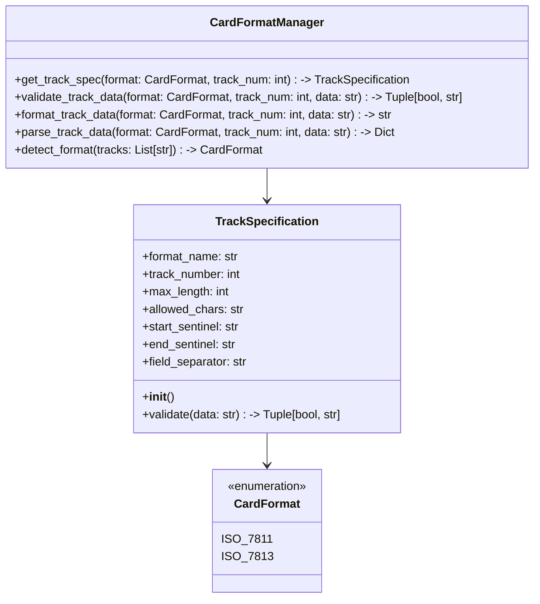

# Technical Reference for MSR605 Card Reader/Writer

## Architecture Overview

### System Components
- **GUI Module**: `GUI.py`
- **Card Reader Interface**: `cardReader.py`
- **Database Management**: Integrated SQLite
- **Version Control**: `version.py`
- **Sponsor Management**: `sponsor.py`
- **About Information**: `about.py`

## Software Design

### Design Principles
- Modular architecture
- Separation of concerns
- High cohesion
- Low coupling

### Module Responsibilities

#### GUI Module
- User interaction handling
- Window management
- Event processing

#### Card Reader Module
- Hardware communication
- Low-level card reading/writing
- Error handling
- Track data processing

#### Database Module
- Data persistence
- CRUD operations
- Query management

## Communication Protocols

### Serial Communication
- Baud Rate: 9600
- Data Bits: 8
- Stop Bits: 1
- Parity: None
- Flow Control: None

## Card Format Implementation

The application implements a flexible card format system supporting multiple magnetic stripe card standards. This section details the technical implementation of the format handling system.

### Card Format Architecture

#### Core Components

- **CardFormat Enum**: Defines supported formats (ISO_7811, ISO_7813)
- **TrackSpecification Class**: Defines track characteristics for each format
- **CardFormatManager**: Manages format validation and data parsing
- **Format Detection**: Auto-detects card format based on track data

#### Class Hierarchy

### Card Data Encoding

#### Supported Standards

- **ISO/IEC 7811**: General purpose magnetic stripe cards
- **ISO/IEC 7813**: Financial transaction cards (subset of 7811)

#### Track Specifications

##### ISO 7811

- **Track 1**: Alphanumeric (up to 79 chars)
  - Format: `%[format code][primary account number]^[name]^[expiration date][service code][discretionary data]?`
  - Character Set: A-Z, 0-9, space, !"%&'()*+,-./:;<=>?_#
  

- **Track 2**: Numeric (up to 40 chars)
  - Format: `;[primary account number]=[expiration date][service code][discretionary data]?`
  - Character Set: 0-9, =, ?
  

- **Track 3**: Read/Write (up to 107 chars)
  - Primarily numeric data
  - Used for financial transactions

##### ISO 7813 (Financial Transaction Cards)

- **Track 1**: Strictly formatted
  - Format code must be 'B' (banking)
  - Fixed field lengths for certain elements
  - Enhanced validation rules
  

- **Track 2**: Numeric with specific validation
  - Similar to ISO 7811 but with additional constraints
  - Strict field validation

### Data Flow

1. **Reading a Card**

   - Read raw track data from hardware
   - Auto-detect format based on track data
   - Parse and validate data according to format
   - Return structured data object

2. **Writing a Card**

   - Validate input data against selected format
   - Format data according to track specifications
   - Write formatted data to card
   - Verify write operation

### Error Handling

#### Validation Errors

- **Invalid Format**: Data doesn't match expected format
- **Invalid Character**: Unsupported character in track data
- **Field Length**: Data exceeds maximum track length
- **Missing Sentinel**: Missing start/end sentinels
- **Invalid Field**: Field validation failed (e.g., invalid expiration date)

#### Recovery

- Detailed error messages with specific validation failures
- Automatic format detection fallback
- Graceful degradation when partial data is available
- Track 2: ABA format
- Track 3: Custom/Extended format

## Performance Metrics

### Read/Write Speed
- Average Read Time: <500ms
- Average Write Time: <1000ms
- Maximum Tracks: 3

### Resource Utilization
- Memory Footprint: <100MB
- CPU Usage: Low to Moderate
- Disk Space: <500MB

## Error Handling

### Error Categories
- Hardware Errors
- Communication Errors
- Data Parsing Errors
- Database Errors

### Error Logging
- Timestamp
- Error Type
- Detailed Description
- Suggested Resolution

## Security Considerations

### Data Protection
- No card data storage without consent
- Encrypted database (optional)
- Configurable data retention policies

### Compliance
- GDPR considerations
- PCI DSS guidelines
- Data minimization principles

## Extensibility

### Plugin Architecture
- Support for custom track parsers
- Extensible database backends
- Configurable hardware interfaces

## Development Environment

### Recommended Tools
- Python 3.12+
- Visual Studio Code
- PyCharm
- Git
- Virtual Environment

### Recommended Extensions
- Python
- Pylance
- GitLens
- Markdown All in One

## Build and Deployment

### Build Process
- Use `pyinstaller` for executable
- Create platform-specific installers
- Sign executables

### Continuous Integration
- GitHub Actions
- Automated testing
- Version compatibility checks

## API and Extensibility

### Public Methods
- `read_card()`
- `write_card()`
- `decode_track()`
- `export_database()`

### Configuration Options
- Hardware settings
- Database preferences
- Decoding rules
- User interface customization

## Roadmap and Future Development
- Machine learning card analysis
- Cloud synchronization
- Multi-language support
- Advanced hardware compatibility
